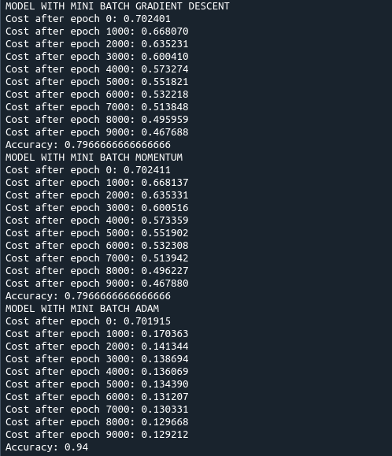
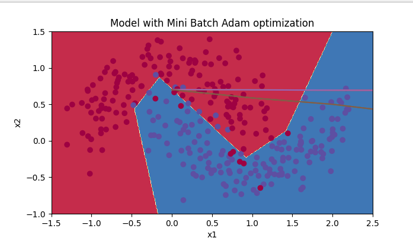

# Optimization

This repo contains the core deep neural network optimization functions like mini batch, gradient descent, momentum, Adam optimization functions written in Python from scratch. 

opt_utils.py is a helper script and contains the optimization functions, models, etc and utils.py is also a helper script that has core deep neural network functions like forward_propagation, backward_propagation, compute_cost etc written from scratch.

The results for 1000 epochs are shown in the below image. Adam optimization has better results than Gradient Descent and Momentum. These three optimization algorithms here also uses mini batch technique.

## Dependencies
* Python >= 3.9.13
    * Pip: [click here for installation instructions](https://pip.pypa.io/en/stable/installation/)

## Instructions

1. Clone the project repository.

2. Install the requirements: `pip install -r requirements.txt` 

3. Run the project: `python main.py`

4. The output should look like the following:

